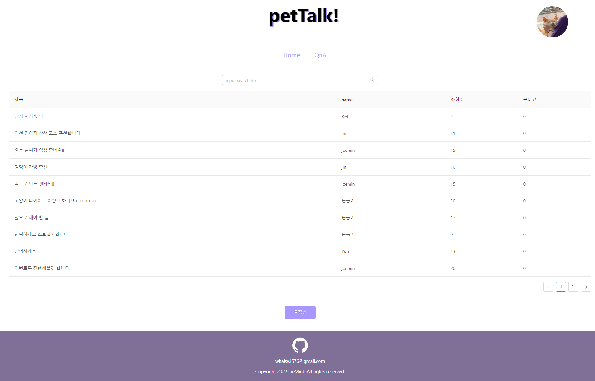
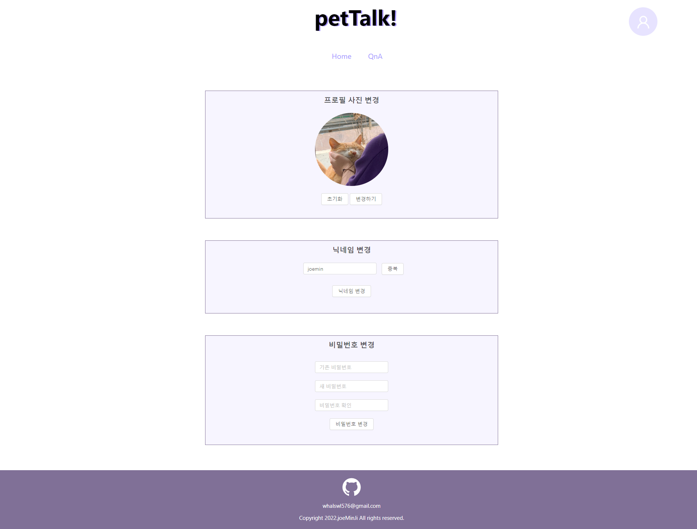
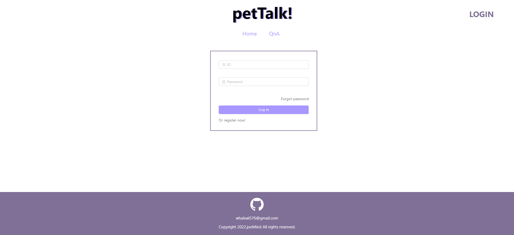
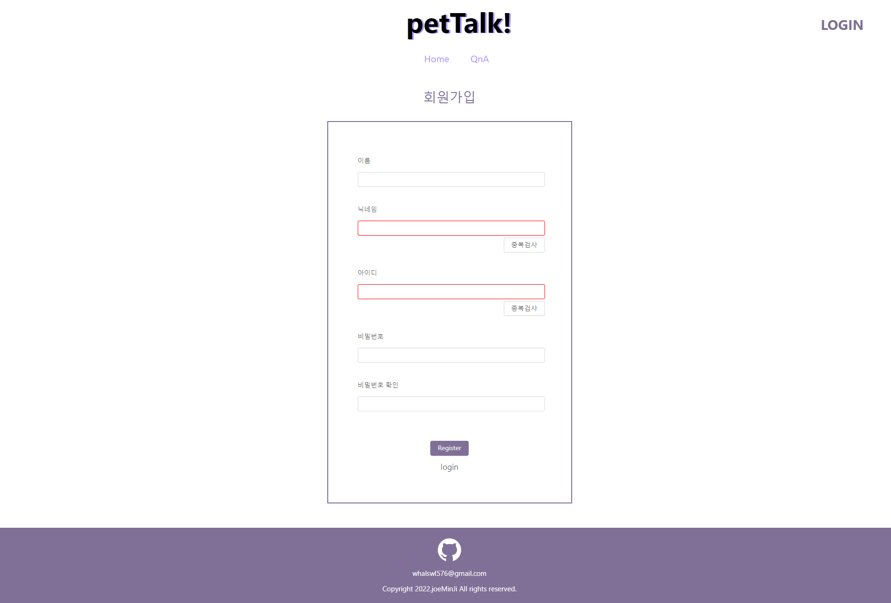

# petTalk!
### Vue를 이용한 CRUD 반려동물 게시판

 

# 프로젝트 개발 환경 및 사용 기술
### **IDE : Visual Studio Code**

 

## **Client**
#### NPM
#### webpack
#### Vue.js + Vuex

 

## **Server**
#### node.js 
#### express.js
#### MySql

 

## **API**
#### Axios

 

# 프로젝트 결과물

## **Home**

 

## **Q&A**

 

## **글 작성**

 

## **메인 페이지**

 

## **내가 쓴 글**

 

## **회원정보 변경**

 

## **로그인**

 

## **회원가입**

 

# 추후 추가 예정
### 좋아요 
### 검색

 
